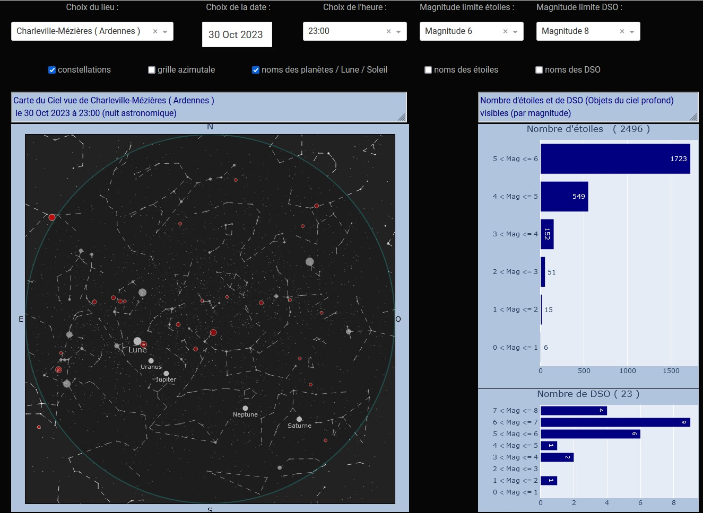

# Sky_Map_dash
## Carte du ciel (étoilé) interactive en python-dash / Interactive skymap with python-dash

Carte du ciel interactive avec :
- 📆 choix du jour et de l'heure (au quart d'heure près)
- 🌍 choix du lieu d'observation (en France ; pour d'autres endroits, changer le fichier 'villes_pop_coord1000.csv')
- 🌟 choix des limites de magnitude (pour les étoiles et pour les DSO*)
- possibilité affichage :
  -  ♌ tracé des constellations
  -  🌐 grille azimutale
  -  🌔 nom des planètes / de la Lune / du Soleil
  -  🔭 nom des DSO
- 🌇la couleur du fond de la carte change en fonction de l'heure (crépuscule civil, nautique, astronomique)

📊 Graphique supplémentaire permettant de connaître le nombre d'étoiles et de DSO théoriquement visibles

🐍 Programmation en Python, avec utilisation de Dash et mise en ligne sur Render.  

:page_facing_up: Documentation utilisée :

[Viyaleta Apgar sur medium.com](https://viyaleta.medium.com/how-to-make-a-sky-map-in-python-a362bf722bb2)  
[skyfield](https://rhodesmill.org/skyfield/examples.html#when-is-the-galactic-center-above-the-horizon)

(*DSO = Deep Sky Object : objet du ciel profond, galaxie, nébuleuse, amas...)  

<a href="https://sky-map-interactive.onrender.com/" target="_blank">Sky Map Interactive

  
<a href="https://sky-map-interactive.onrender.com/" target="_blank">
